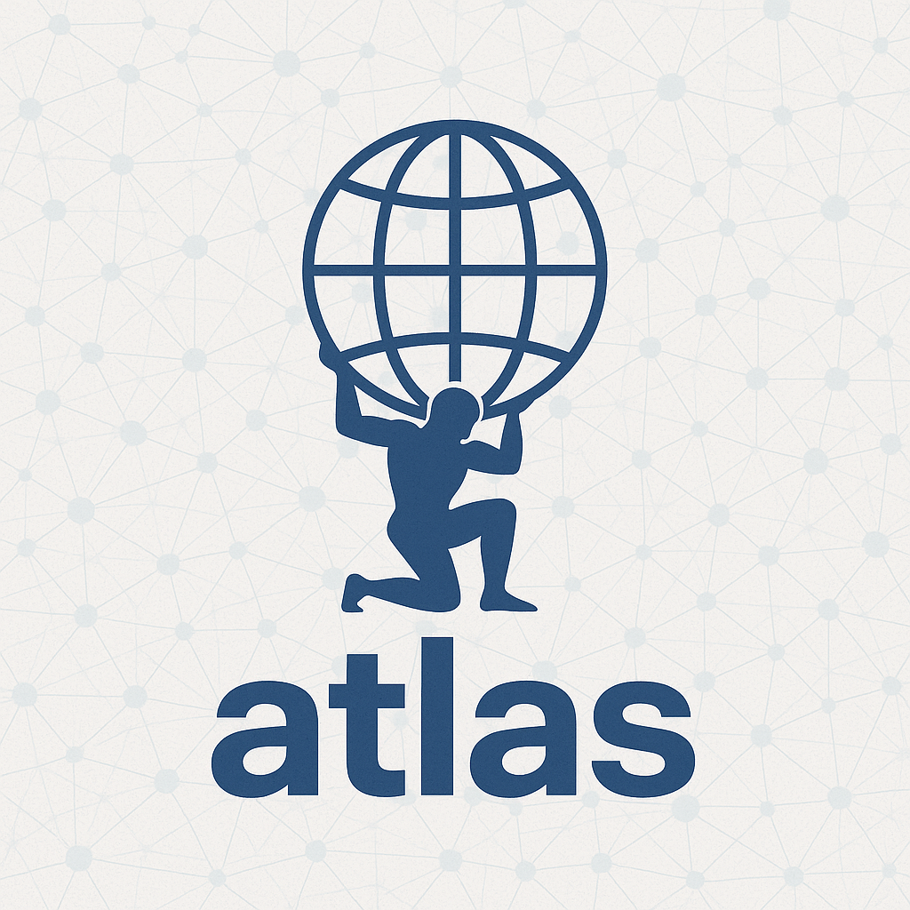

# Atlas

`Atlas` is a toolkit for building resilient and scalable distributed systems.
It provides with set of tools and libraries to help you work with distributed
systems, including:

- **Service Registry and Discovery**
- **Load Balancing**
- **Circuit Breaker**

> [!WARNING]
> This is an *educational* and *recreational* project, **not** a production-ready solution.
> It is not intended to be a production-ready solution, but rather a learning tool.
> For production-ready solutions, please refer to existing frameworks and libraries.
> This project is inspired by Netflix OSS, Spring Cloud, and other similar projects.
---

## Table of Contents

- [Atlas](#atlas)
    - [Components](#components)
    - [What is Atlas?](#what-is-atlas)
    - [Getting Started](#getting-started)
    - [LICENSE](#license)

---

## Components

| Module           | Purpose                                                          |
|------------------|------------------------------------------------------------------|
| `atlas-registry` | Service discovery registry — like Eureka                         |
| `atlas-beacon`   | Client-side auto-registration/heartbeat lib — like Eureka client |
| `atlas-compass`  | Client-side load balancer — like Ribbon                          |
| `atlas-client`   | HTTP wrapper that routes requests using Compass                  |
| `atlas-shield`   | *(Planned)* Circuit breaker & fallback handler — like Hystrix    |

---

## What is Atlas?

Atlas is **not a framework** — it’s a **collection of standalone, interoperable tools**
that solve common problems in microservices and distributed system design.

Building atlas is a **learning project** to understand the principles of distributed systems,
and to experiment with concepts like:

- Understand and experiment with service discovery internals
- Learn how to build a client-side load balancer
- Experiment with circuit breaker patterns

---

## Getting Started

*Coming soon! This project is still in early development stages.*

---

## LICENSE

This project is licensed under the [MIT License](LICENSE).